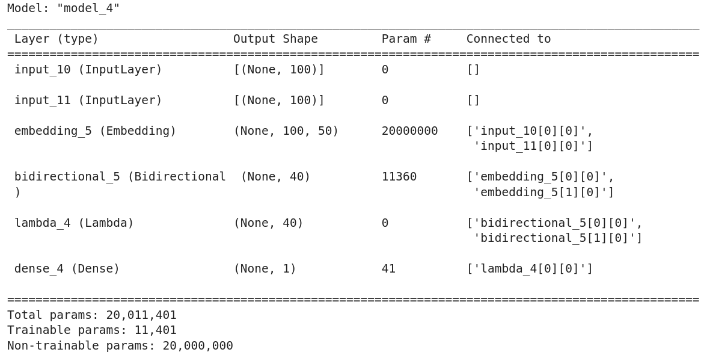

# Text similarity with siamese networks, Tensorflow
Trained a siamese network to classify similar and non similar sentences.

For this task i used [Quora Question Pairs](https://www.kaggle.com/c/quora-question-pairs) dataset.


## Architecture of the model:
- For embedding used the popular GloVe (Global Vectors for Word Representation) embedding model.the pre-trained model obtained [GloVe](https://nlp.stanford.edu/projects/glove/) and load it as our first layer as the embedding layer.

- Used a Bidirectional LSTM which grasp the meaning of the sentenceses.

- for the following we can do multiple tasks like concatenate outputs of sentence 1 and 2 or calculate L2 or euclidean distance, here we calculated Manhattan Distance (Also called L1 Distance).

- At the end put a Linear layer for classification.


## Train the model:
- Create an environment and install requirement ```pip install -r requirement.txt```

- Configure the ```config.json``` file by adding path to the GloVe model and etc.

- Run ```main.py```

The ```model.summary()``` is as follow:




